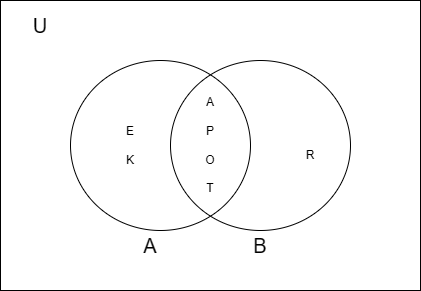

# Kuis 1

## Soal 1

Jika premis-premisnya benar, maka kesimpulannya **r** (Saya lulus ujian) benar.

### Contoh Nyata:
- **Premis 1**: Jika saya pulang kampung, maka saya tidak bisa mengikuti ujian susulan.
- **Premis 2**: Jika saya tidak lulus ujian, maka saya pulang kampung.
- **Premis 3**: Saya bisa mengikuti ujian susulan.

---

## Soal 2

Gunakan tabel kebenaran untuk menunjukkan bahwa tiap implikasi berikut adalah tautologi:

### (a) \(\sim p \rightarrow (p \rightarrow q)\)

| p   | q   | \(\sim p\) | \(p \rightarrow q\) | \(\sim p \rightarrow (p \rightarrow q)\) |
| --- | --- | ---------- | ------------------- | ---------------------------------------- |
| T   | T   | F          | T                   | T                                        |
| T   | F   | F          | F                   | T                                        |
| F   | T   | T          | T                   | T                                        |
| F   | F   | T          | T                   | T                                        |

Jadi, \(\sim p \rightarrow (p \rightarrow q)\) adalah **tautologi**.

---

### (b) \(\sim(p \rightarrow q) \rightarrow \sim q\)

| p   | q   | \(p \rightarrow q\) | \(\sim(p \rightarrow q)\) | \(\sim q\) | \(\sim(p \rightarrow q) \rightarrow \sim q\) |
| --- | --- | ------------------- | ------------------------- | ---------- | -------------------------------------------- |
| T   | T   | T                   | F                         | F          | T                                            |
| T   | F   | F                   | T                         | T          | T                                            |
| F   | T   | T                   | F                         | F          | T                                            |
| F   | F   | T                   | F                         | T          | T                                            |

Jadi, \(\sim(p \rightarrow q) \rightarrow \sim q\) adalah **tautologi**.

---

### (c) \((p \land q) \rightarrow (p \rightarrow q)\)

| p   | q   | \(p \land q\) | \(p \rightarrow q\) | \((p \land q) \rightarrow (p \rightarrow q)\) |
| --- | --- | ------------- | ------------------- | --------------------------------------------- |
| T   | T   | T             | T                   | T                                             |
| T   | F   | F             | F                   | T                                             |
| F   | T   | F             | T                   | T                                             |
| F   | F   | F             | T                   | T                                             |

Jadi, \((p \land q) \rightarrow (p \rightarrow q)\) adalah **tautologi**.

---

## Soal 3

Misalkan:

- \(U =\) himpunan mahasiswa
- \(P =\) himpunan mahasiswa yang nilai ujian UTS di atas 80
- \(Q =\) himpunan mahasiswa yang nilai ujian UAS di atas 80

Seorang mahasiswa mendapat nilai:
- **A** jika nilai UTS dan nilai UAS keduanya di atas 80, yaitu \(P \cap Q\).
- **B** jika salah satu ujian di atas 80, yaitu \((P \cap \sim Q) \cup (\sim P \cap Q)\).
- **C** jika kedua ujian di bawah 80, yaitu \(\sim P \cap \sim Q\).

---

## Soal 4

Diketahui:

- \(A = \{a, p, o, t, e, k\}\), yaitu huruf pembentuk kata "apotek".
- \(B = \{r, a, p, o, t\}\).

### A ∪ B

\[
A ∪ B = \{a, p, o, t, e, k, r\}
\]

### Diagram Venn

- \(A\) diwakili oleh lingkaran berisi \(a, p, o, t, e, k\).
- \(B\) diwakili oleh lingkaran berisi \(a, p, o, t, r\).
- Irisan \(A ∩ B\) berisi \(a, p, o, t\).

---

## Soal 5

Diketahui:

- \(A = \{1, 2, 5, 6, 7, 11, 12, 13, 15, 18, 20\}\)
- \(B = \{2, 3, 4, 5, 6, 7, 8, 12, 13\}\)
- \(C = \{1, 2, 3, 6, 8, 9, 10, 13, 17, 18\}\)
- \(S = \{x | x \leq 20, x =\) bilangan asli\}

### \(A ∩ C\)

\[
A ∩ C = \{1, 2, 6, 13, 18\}
\]
