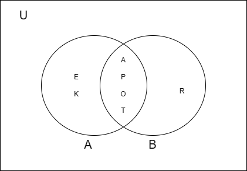

# Kuis 1

## No. 1

Asumsikan semua premis benar, maka kesimpulan **r** (Saya lulus ujian) juga dapat dianggap benar.

### Contoh Kasus:
- **Premis 1**: Jika saya pulang kampung, maka saya tidak bisa mengikuti ujian susulan.
- **Premis 2**: Jika saya gagal ujian, maka saya pulang kampung.
- **Premis 3**: Faktanya, saya bisa mengikuti ujian susulan.

---

## No. 2

Buktikan bahwa setiap implikasi di bawah ini adalah tautologi menggunakan tabel kebenaran:

### (a) \(\neg p \rightarrow (p \rightarrow q)\)

| p   | q   | \(\neg p\) | \(p \rightarrow q\) | \(\neg p \rightarrow (p \rightarrow q)\) |
|-----|-----|------------|---------------------|------------------------------------------|
| B   | B   | S          | B                   | B                                        |
| B   | S   | S          | S                   | B                                        |
| S   | B   | B          | B                   | B                                        |
| S   | S   | B          | B                   | B                                        |

**Kesimpulan**: \(\neg p \rightarrow (p \rightarrow q)\) adalah **tautologi**.

---

### (b) \(\neg(p \rightarrow q) \rightarrow \neg q\)

| p   | q   | \(p \rightarrow q\) | \(\neg(p \rightarrow q)\) | \(\neg q\) | \(\neg(p \rightarrow q) \rightarrow \neg q\) |
|-----|-----|---------------------|---------------------------|------------|----------------------------------------------|
| B   | B   | B                   | S                         | S          | B                                            |
| B   | S   | S                   | B                         | B          | B                                            |
| S   | B   | B                   | S                         | S          | B                                            |
| S   | S   | B                   | S                         | B          | B                                            |

**Kesimpulan**: \(\neg(p \rightarrow q) \rightarrow \neg q\) adalah **tautologi**.

---

### (c) \((p \land q) \rightarrow (p \rightarrow q)\)

| p   | q   | \(p \land q\) | \(p \rightarrow q\) | \((p \land q) \rightarrow (p \rightarrow q)\) |
|-----|-----|----------------|---------------------|-----------------------------------------------|
| B   | B   | B              | B                   | B                                             |
| B   | S   | S              | S                   | B                                             |
| S   | B   | S              | B                   | B                                             |
| S   | S   | S              | B                   | B                                             |

**Kesimpulan**: \((p \land q) \rightarrow (p \rightarrow q)\) adalah **tautologi**.

---

## No. 3

Misalkan:

- \(U =\) himpunan mahasiswa
- \(P =\) mahasiswa yang mendapat nilai UTS lebih dari 80
- \(Q =\) mahasiswa yang mendapat nilai UAS lebih dari 80

Seorang mahasiswa mendapatkan:
- **Nilai A** jika nilai UTS dan UAS lebih dari 80, yaitu \(P \cap Q\).
- **Nilai B** jika salah satu dari UTS atau UAS lebih dari 80, yaitu \((P \cap \neg Q) \cup (\neg P \cap Q)\).
- **Nilai C** jika kedua nilai UTS dan UAS di bawah 80, yaitu \(\neg P \cap \neg Q\).

---

## No. 4

Diketahui:

- \(A = \{a, p, o, t, e, k\}\) adalah huruf-huruf dari kata "apotek".
- \(B = \{r, a, p, o, t\}\).

### A ∪ B

Maka, gabungan \( A \cup B = \{a, p, o, t, e, k, r\} \)

### Diagram Venn

- **Lingkaran \(A\)**: \(a, p, o, t, e, k\).
- **Lingkaran \(B\)**: \(a, p, o, t, r\).
- **Irisan \(A ∩ B\)**: \(a, p, o, t\).

---

## No. 5

Diberikan:

- \(A = \{1, 2, 5, 6, 7, 11, 12, 13, 15, 18, 20\}\)
- \(B = \{2, 3, 4, 5, 6, 7, 8, 12, 13\}\)
- \(C = \{1, 2, 3, 6, 8, 9, 10, 13, 17, 18\}\)
- \(S = \{x | x \leq 20, x =\) bilangan asli\}

### \(A ∩ C\)

Maka, irisan \( A \cap C = \{1, 2, 6, 13, 18\} \)
