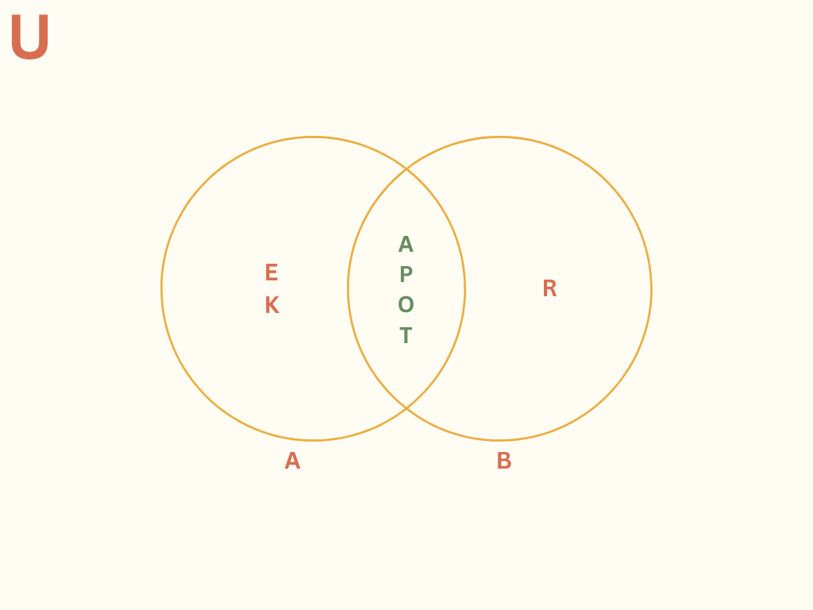

# SOAL 1
p = Saya pulang kampung  
q = Saya bisa mengikuti ujian susulan  
r = Saya lulus ujian  
~q = Saya tidak bisa mengikuti ujian susulan  
~r = Saya tidak lulus ujian  

Jika saya pulang kampung, maka saya tidak mengikuti ujian susulan. (p → ~q)  
Jika saya tidak lulus ujian, maka saya pulang kampung. (~r → p)  
Tetapi saya bisa mengikuti ujian susulan. (q)  
Oleh karena itu saya lulus ujian. (r) atau kesimpulan  

Argumen tersebut valid atau sahih, karena saya bisa mengikuti ujian dan saya lulus ujian, kecuali jika saya pulang kampung maka saya tidak bisa mengikuti ujian dan tidak lulus ujian

# SOAL 2
a. ~p → (p → q)
| p   | q   | ~p  | (p → q) | ~p → (p → q) |
|-----|-----|-----|---------|--------------|
| B   | B   | S   | B       | B            |
| B   | S   | S   | S       | B            |
| S   | B   | B   | B       | B            |
| S   | S   | B   | B       | B            |

b. ~(p → q) → ~q
| p   | q   | ∼q  | (p → q) | ∼(p → q) | ∼(p → q) → ∼q |
|-----|-----|-----|---------|----------|----------------|
| B   | B   | S   | B       | S        | B              |
| B   | S   | B   | S       | B        | B              |
| S   | B   | S   | B       | S        | S              |
| S   | S   | B   | B       | S        | B              |

c. (p ∧ q) → (p → q)
| p   | q   | (p ∧ q) | (p → q) | (p ∧ q) → (p → q) |
|-----|-----|---------|---------|-------------------|
| B   | B   | B       | B       | B                 |
| B   | S   | S       | S       | B                 |
| S   | B   | S       | B       | B                 |
| S   | S   | S       | B       | B                 |

# SOAL 3 
1. Mahasiswa yang mendapat nilai A (nilai UTS dan nilai UAS keduanya di atas 80):

    𝐴 = 𝑃 ∩ 𝑄

    Ini merupakan irisan antara himpunan P (mahasiswa dengan nilai UTS di atas 80) dan Q (mahasiswa dengan nilai UAS di atas 80).

2. Mahasiswa yang mendapat nilai B (salah satu ujian di atas 80, baik UTS atau UAS):

    𝐵 = (𝑃 ∪ 𝑄)∖(𝑃 ∩ 𝑄)

    Ini adalah himpunan gabungan P dan Q tetapi tanpa elemen irisan. Artinya, mahasiswa yang hanya salah satu dari nilainya yang di atas 80 (bukan keduanya).

3. Mahasiswa yang mendapat nilai C (nilai UTS dan UAS keduanya di bawah 80):

    𝐶 = 𝑈∖(𝑃 ∪ 𝑄)

    Ini adalah komplemen dari gabungan P dan Q terhadap himpunan U. Mahasiswa ini tidak termasuk di dalam himpunan P ataupun Q.

Jadi, notasi himpunan untuk tiap nilai mahasiswa adalah:

- A = 𝑃 ∩ 𝑄

- B = (𝑃 ∪ 𝑄)∖(𝑃 ∩ 𝑄)

- C = 𝑈∖(𝑃 ∪ 𝑄)

# SOAL 4

A ∪ B = {a, p, o, t}

# SOAL 5
Cari elemen yang ada di kedua himpunan:

Elemen yang ada di 
𝐴 : 1, 2, 5, 6, 7, 11, 12, 13, 15, 18, 20

Elemen yang ada di 
𝐶 : 1, 2, 3, 6, 8, 9, 10, 13, 17, 18

Elemen yang sama di kedua himpunan adalah:
1, 2, 6, 13, 18

Maka, irisan dari himpunan 
𝐴 dan 𝐶 adalah:

𝐴 ∩ 𝐶 = {1, 2 , 6, 13, 18}