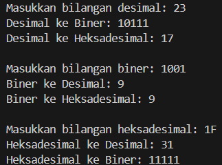

# **UTS MATDAS**

## Tugas 1

### Nama    : Bintang Pancahaya Prasetyo
### NIM     : 244107020115
### Jurusan : Teknologi Informasi
### Prodi   : D4 Teknik Informatika
### Kelas   : TI 1H

##

**Point 1 : Mengubah Desimal ke Biner dan Heksadesimal**

```
import java.util.Scanner;
public class Tugas1 {
    public static void main(String[] args) {
        Scanner input = new Scanner(System.in);
```
`import java.util.Scanner;` Mengimpor kelas Scanner dari pustaka Java, yang digunakan untuk membaca input dari pengguna.  
`public class Tugas1` Mendeklarasikan kelas publik bernama KonversiBilangan. Kelas ini akan menyimpan metode main.  
`public static void main(String[] args)` Mendeklarasikan metode utama yang menjadi titik awal eksekusi program.
```
        // Ubah bilangan desimal ke biner dan heksadesimal
        System.out.print("Masukkan bilangan desimal: ");
        int desimal = input.nextInt();
```
Kode program ini, mengubah bilangan desimal menjadi biner dan heksadesimal.
`System.out.print("Masukkan bilangan desimal: ");` Mencetak pesan ke konsol untuk meminta pengguna memasukkan bilangan desimal.  
`int desimal = input.nextInt();` Membaca bilangan desimal yang dimasukkan oleh pengguna dan menyimpannya dalam variabel desimal.
```
        // Konversi ke biner
        String biner = "";
        int sisa = desimal;
        while (sisa > 0) {
            biner = (sisa % 2) + biner;
            sisa /= 2;
        }
        while (biner.length() < 4) {
            biner = "0" + biner;
        }
```
Fungsi kode program ini, untuk mengkonversi dari desimal ke biner.  
`String biner = "";` Mendeklarasikan variabel string kosong biner untuk menyimpan hasil konversi biner.  
`int sisa = desimal;` Menyimpan nilai desimal dalam variabel sisa untuk dioperasikan.  
`while (sisa > 0)` Memulai loop yang akan terus berjalan hingga sisa menjadi 0.  
`biner = (sisa % 2) + biner;` Menghitung sisa pembagian sisa dengan 2 dan menambahkan hasilnya ke depan string biner. Ini memastikan hasil biner dimunculkan dari belakang ke depan.  
`sisa /= 2;` Membagi sisa dengan 2 untuk mengurangi nilainya pada iterasi berikutnya.  
`while (biner.length() < 4) { biner = "0" + biner; }` Jika elemen dari biner kurang dari 4 maka akan menambahkan String 0.
        
 ```  
// Konversi ke heksadesimal
        String heksadesimal = "";
        sisa = desimal;
        char[] hexDigit = {'0','1','2','3','4','5','6','7','8','9','A','B','C','D','E','F'};
        while (sisa > 0) {
            heksadesimal = hexDigit[sisa % 16] + heksadesimal;
            sisa /= 16;
        }
``` 
`hexDigit = "0123456789ABCDEF";` Mendeklarasikan char hexDigit yang berisi semua karakter heksadesimal.  
`heksadesimal = hexDigits.charAt(sisa % 16) + heksadesimal;` Menghitung sisa pembagian sisa dengan 16, menggunakan charAt untuk mengambil karakter yang sesuai dari hexDigit, dan menambahkannya ke depan string heksadesimal.
```        
        System.out.println("Desimal ke Biner: " + biner);
        System.out.println("Desimal ke Heksadesimal: " + heksadesimal);
```
`System.out.println("Desimal ke Biner: " + biner);` Mencetak hasil konversi biner ke konsol.  
`System.out.println("Desimal ke Heksadesimal: " + heksadesimal);` Mencetak hasil konversi heksadesimal ke konsol.
#
**Point 2 : Mengubah Biner ke Desimal dan Heksadesimal**
```
        System.out.println();
        
        // Ubah bilangan biner ke desimal dan heksadesimal
        System.out.print("Masukkan bilangan biner: ");
        String binerInput = input.next();
        
        int desimalDariBiner = 0;
        int nilai = 1; // 2^0 = 1
        for (int i = binerInput.length() - 1; i >= 0; i--) {
            desimalDariBiner += (binerInput.charAt(i) - '0') * nilai;
            nilai *= 2; // Kalikan nilai dengan 2 untuk pangkat berikutnya
        }
```
`int desimalDariBiner = 0;` Mendeklarasikan variabel untuk menyimpan hasil konversi dari biner ke desimal.  
`int nilai = 1;` Inisialisasi `nilai` untuk menyimpan pangkat dua yang mulai dari 
2^0 (1).  
`for (int i = binerInput.length() - 1; i >= 0; i--)` Memulai loop dari karakter paling kanan ke kiri.  
`desimalDariBiner += (binerInput.charAt(i) - '0') * nilai;` Menghitung nilai desimal dengan mengalikan nilai biner (0 atau 1) dengan nilai, lalu menambahkan ke desimalDariBiner.  
`nilai *= 2;` Mengalikan nilai dengan 2 untuk perhitungan pangkat berikutnya.
```
        // Konversi desimalDariBiner ke heksadesimal
        heksadesimal = "";
        sisa = desimalDariBiner;
        while (sisa > 0) {
            heksadesimal = hexDigit[sisa % 16] + heksadesimal;
            sisa /= 16;
        }
        
        System.out.println("Biner ke Desimal: " + desimalDariBiner);
        System.out.println("Biner ke Heksadesimal: " + heksadesimal);

        System.out.println();
```
Kode diatas mengkonversikan desimal dari biner ke heksadesimal.
#
**Point 3 : Mengubah Heksadesimal ke Desimal dan Biner**
```
        // Ubah bilangan heksadesimal ke desimal dan biner
        System.out.print("Masukkan bilangan heksadesimal: ");
        String heksadesimalInput = input.next().toUpperCase();
        
        int desimalDariHex = 0;
        nilai = 1; // 16^0 = 1
        for (int i = heksadesimalInput.length() - 1; i >= 0; i--) {
            char hexChar = heksadesimalInput.charAt(i);
            int nilaiHex = (hexChar >= '0' && hexChar <= '9') ? (hexChar - '0') : (hexChar - 'A' + 10);
            desimalDariHex += nilaiHex * nilai;
            nilai *= 16; // Kalikan nilai dengan 16 untuk pangkat berikutnya
        }
```
`int desimalDariHex = 0;` Mendeklarasikan variabel untuk menyimpan hasil konversi dari heksadesimal ke desimal.  
`nilai = 1;` Inisialisasi nilai untuk menyimpan pangkat enam belas yang mulai dari 
16^0 (1).  
`for (int i = heksadesimalInput.length() - 1; i >= 0; i--)` Memulai loop dari karakter paling kanan ke kiri.  
`char hexChar = heksadesimalInput.charAt(i);` Mengambil karakter heksadesimal saat ini.
`int nilaiHex = (hexChar >= '0' && hexChar <= '9') ? (hexChar - '0') : (hexChar - 'A' + 10);` Mengonversi karakter heksadesimal ke nilai desimal. Jika karakter adalah antara '0' dan '9', hasilnya adalah char '0'. Jika karakter adalah antara 'A' dan 'F', hasilnya adalah char 'A' + 10.
`desimalDariHex += nilaiHex * nilai;` Menghitung nilai desimal dengan mengalikan nilaiHex dengan nilai, lalu menambahkan ke desimalDariHex.  
`nilai *= 16;` Mengalikan nilai dengan 16 untuk perhitungan pangkat berikutnya.
 ```       
        // Konversi desimalDariHex ke biner
        biner = "";
        sisa = desimalDariHex;
        while (sisa > 0) {
            biner = (sisa % 2) + biner;
            sisa /= 2;
        }
        while (biner.length() < 4) {
            biner = "0" + biner;
        }
        
        System.out.println("Heksadesimal ke Desimal: " + desimalDariHex);
        System.out.println("Heksadesimal ke Biner: " + biner);
        
        input.close();
    }
}

```
Kode diatas mengkonversi desimal dari heksadesimal ke biner.
#
**Contoh Output**

