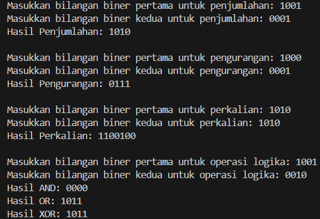

# **UTS MATDAS**

## Tugas 2

### Nama    : Bintang Pancahaya Prasetyo
### NIM     : 244107020115
### Jurusan : Teknologi Informasi
### Prodi   : D4 Teknik Informatika
### Kelas   : TI 1H

##

**Point 1 : Penjumlahan Biner**
```
import java.util.Scanner;

public class Tugas2 {
    public static void main(String[] args) {
        Scanner input = new Scanner(System.in);
```
`import java.util.Scanner;` Mengimpor kelas Scanner dari pustaka Java, yang digunakan untuk membaca input dari pengguna.  
`public class Tugas2` Mendeklarasikan kelas publik bernama KonversiBilangan. Kelas ini akan menyimpan metode main.  
`public static void main(String[] args)` Mendeklarasikan metode utama yang menjadi titik awal eksekusi program.
```
        // Penjumlahan Biner
        System.out.print("Masukkan bilangan biner pertama untuk penjumlahan: ");
        String biner1 = input.next();
        System.out.print("Masukkan bilangan biner kedua untuk penjumlahan: ");
        String biner2 = input.next();

        int desimal1 = 0, desimal2 = 0, pangkat = 1;
```
`System.out.print(...)` Menampilkan teks ke layar untuk meminta input pengguna.  
`String biner1 = input.next();` Menerima input biner pertama sebagai String dan menyimpannya di `biner1`.  
`String biner2 = input.next();` Menerima input biner kedua sebagai String dan menyimpannya di `biner2`.  
`int desimal1 = 0, desimal2 = 0, pangkat = 1;` Mendeklarasikan variabel untuk menyimpan nilai desimal hasil konversi dan variabel pangkat untuk melakukan konversi biner ke desimal.        
```
        // Konversi biner1 ke desimal
        for (int i = biner1.length() - 1; i >= 0; i--) {
            desimal1 += (biner1.charAt(i) - '0') * pangkat;
            pangkat *= 2;
        }
```
Kode program ini mengonversikan biner 1 ke desimal  
`for (int i = biner1.length() - 1; i >= 0; i--)` Mengiterasi setiap digit dari biner1 mulai dari posisi paling kanan.  
`desimal1 += (biner1.charAt(i) - '0') * pangkat;` Mengonversi setiap digit biner ke desimal.   
`biner1.charAt(i) - '0'` mengubah karakter menjadi integer, lalu dikalikan dengan pangkat (pangkat dari 2) dan ditambahkan ke `desimal1`.  
`pangkat *= 2;` Mengalikan pangkat dengan 2 untuk setiap iterasi agar sesuai dengan posisi bit.  
```      
        // Konversi biner2 ke desimal
        pangkat = 1;
        for (int i = biner2.length() - 1; i >= 0; i--) {
            desimal2 += (biner2.charAt(i) - '0') * pangkat;
            pangkat *= 2;
        }
```
Mengulangi proses yang sama untuk biner 2 dengan mereset pangkat ke 1 untuk konversi dari biner ke desimal.
```        
        int hasilPenjumlahan = desimal1 + desimal2;
        String hasilBinerPenjumlahan = "";
        while (hasilPenjumlahan > 0) {
            hasilBinerPenjumlahan = (hasilPenjumlahan % 2) + hasilBinerPenjumlahan;
            hasilPenjumlahan /= 2;
        }
```
`int hasilPenjumlahan = desimal1 + desimal2;` Menjumlahkan dua bilangan desimal yang dihasilkan dari konversi biner.  
`String hasilBinerPenjumlahan = "";` Inisialisasi string kosong untuk menyimpan hasil penjumlahan dalam bentuk biner.  
`while (hasilPenjumlahan > 0)` Mengonversi hasil desimal kembali ke biner dengan membagi hasil penjumlahan desimal secara berulang dengan 2 dan menyimpan sisa pembagian di depan string `hasilBinerPenjumlahan`.
```
        while (hasilBinerPenjumlahan.length() < 4) {
            hasilBinerPenjumlahan = "0" + hasilBinerPenjumlahan;
        }
        System.out.println("Hasil Penjumlahan: " + hasilBinerPenjumlahan);
```
`while (hasilBinerPenjumlahan.length() < 4)` Menambahkan 0 di depan hasilBinerPenjumlahan agar panjang hasil selalu 4 digit.  
`System.out.println(...)` Menampilkan hasil penjumlahan ke layar. 
#
**Point 2 : Pengurangan Biner**       
```
        System.out.println();

        // Pengurangan Biner
        System.out.print("Masukkan bilangan biner pertama untuk pengurangan: ");
        biner1 = input.next();
        System.out.print("Masukkan bilangan biner kedua untuk pengurangan: ");
        biner2 = input.next();

        desimal1 = 0;
        desimal2 = 0;
        pangkat = 1;

        // Konversi biner1 ke desimal untuk pengurangan
        for (int i = biner1.length() - 1; i >= 0; i--) {
            desimal1 += (biner1.charAt(i) - '0') * pangkat;
            pangkat *= 2;
        }
        // Konversi biner2 ke desimal untuk pengurangan
        pangkat = 1;
        for (int i = biner2.length() - 1; i >= 0; i--) {
            desimal2 += (biner2.charAt(i) - '0') * pangkat;
            pangkat *= 2;
        }
        int hasilPengurangan = desimal1 - desimal2;

        // Konversi desimal ke biner
        String hasilBinerPengurangan = "";
        while (hasilPengurangan > 0) {
            hasilBinerPengurangan = (hasilPengurangan % 2) + hasilBinerPengurangan;
            hasilPengurangan /= 2;
        }
        while (hasilBinerPengurangan.length() < 4) {
            hasilBinerPengurangan = "0" + hasilBinerPengurangan;
        }
        System.out.println("Hasil Pengurangan: " + (hasilBinerPengurangan.length() == 0 ? "0" : hasilBinerPengurangan));
```
Kode untuk pengurangan itu mirip dengan penjumlahan, yang berbeda hanya `int hasilPengurangan = desimal1 - desimal2;` Melakukan pengurangan bilangan desimal hasil konversi.   
`(hasilBinerPengurangan.length() == 0 ? "0" : hasilBinerPengurangan)`
Ini adalah ekspresi ternary (kondisional) yang akan menentukan hasil yang ditampilkan.  
`hasilBinerPengurangan.length() == 0`
Mengecek apakah panjang dari `hasilBinerPengurangan` adalah 0. Jika panjangnya 0, berarti string `hasilBinerPengurangan` kosong.  
`? "0" : hasilBinerPengurangan`
Jika kondisi `hasilBinerPengurangan.length() == 0` benar (string kosong), maka "0" akan dicetak sebagai hasil. Jika kondisi tersebut salah (string tidak kosong), maka nilai `hasilBinerPengurangan` akan dicetak.
#
**Point 3 : Perkalian Biner**
```
        System.out.println();

        // Perkalian Biner
        System.out.print("Masukkan bilangan biner pertama untuk perkalian: ");
        biner1 = input.next();
        System.out.print("Masukkan bilangan biner kedua untuk perkalian: ");
        biner2 = input.next();

        desimal1 = 0;
        desimal2 = 0;
        pangkat = 1;

        // Konversi biner1 ke desimal untuk perkalian
        for (int i = biner1.length() - 1; i >= 0; i--) {
            desimal1 += (biner1.charAt(i) - '0') * pangkat;
            pangkat *= 2;
        }
        // Konversi biner2 ke desimal untuk perkalian
        pangkat = 1;
        for (int i = biner2.length() - 1; i >= 0; i--) {
            desimal2 += (biner2.charAt(i) - '0') * pangkat;
            pangkat *= 2;
        }
        int hasilPerkalian = desimal1 * desimal2;
        String hasilBinerPerkalian = "";
        while (hasilPerkalian > 0) {
            hasilBinerPerkalian = (hasilPerkalian % 2) + hasilBinerPerkalian;
            hasilPerkalian /= 2;
        }
        while (hasilBinerPerkalian.length() < 4) {
            hasilBinerPerkalian = "0" + hasilBinerPenrkalian;
        }
        System.out.println("Hasil Perkalian: " + hasilBinerPerkalian);
```
Kode program untuk perkalian ini juga hampir sama dengan kode program pengurangan dan pertambahan. Yang berbeda hanya `int hasilPerkalian = desimal1 * desimal2;` Melakukan perkalian antara bilangan desimal hasil konversi dari biner.
#
**Point 4 : Operasi Logika**
```       
        System.out.println();

        // Operasi Logika AND, OR, XOR
        System.out.print("Masukkan bilangan biner pertama untuk operasi logika: ");
        biner1 = input.next();
        System.out.print("Masukkan bilangan biner kedua untuk operasi logika: ");
        biner2 = input.next();

        desimal1 = 0;
        desimal2 = 0;
        pangkat = 1;

        // Konversi biner1 ke desimal untuk operasi logika
        for (int i = biner1.length() - 1; i >= 0; i--) {
            desimal1 += (biner1.charAt(i) - '0') * pangkat;
            pangkat *= 2;
        }
        // Konversi biner2 ke desimal untuk operasi logika
        pangkat = 1;
        for (int i = biner2.length() - 1; i >= 0; i--) {
            desimal2 += (biner2.charAt(i) - '0') * pangkat;
            pangkat *= 2;
        }
        int hasilAND = desimal1 & desimal2;
        int hasilOR = desimal1 | desimal2;
        int hasilXOR = desimal1 ^ desimal2;

        String hasilBinerAND = "", hasilBinerOR = "", hasilBinerXOR = "";

        while (hasilAND > 0) {
            hasilBinerAND = (hasilAND % 2) + hasilBinerAND;
            hasilAND /= 2;
        }
        while (hasilOR > 0) {
            hasilBinerOR = (hasilOR % 2) + hasilBinerOR;
            hasilOR /= 2;
        }
        while (hasilXOR > 0) {
            hasilBinerXOR = (hasilXOR % 2) + hasilBinerXOR;
            hasilXOR /= 2;
        }
        while (hasilBinerAND.length() < 4) {
            hasilBinerAND = "0" + hasilBinerAND;
        }
        while (hasilBinerOR.length() < 4) {
            hasilBinerOR = "0" + hasilBinerOR;
        }
        while (hasilBinerXOR.length() < 4) {
            hasilBinerXOR = "0" + hasilBinerXOR;
        }

        input.close();
    }
}
```
Ini adalah kode program untuk operasi logika
`int hasilAND = desimal1 & desimal2;` Melakukan operasi logika AND pada dua bilangan desimal.  
`int hasilOR = desimal1 | desimal2;` Melakukan operasi logika OR pada dua bilangan desimal.  
`int hasilXOR = desimal1 ^ desimal2;` Melakukan operasi logika XOR pada dua bilangan desimal.   
`while (hasilAND > 0)` Mengonversi hasil AND ke biner.  
`hasilBinerAND = "0" + hasilBinerAND;` Menambahkan nol di depan hasil AND agar panjang hasilnya konsisten 4 digit.  
`System.out.println("Hasil AND: " + hasilBinerAND);` Menampilkan hasil AND ke layar.  
Proses yang sama diulangi untuk operasi OR dan XOR.
#
**Contoh Output**

