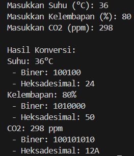

# **UTS MATDAS**

## Tugas 3

### Nama    : Bintang Pancahaya Prasetyo
### NIM     : 244107020115
### Jurusan : Teknologi Informasi
### Prodi   : D4 Teknik Informatika
### Kelas   : TI 1H

##

**Point 1 : Input Data Sensor**
```
import java.util.Scanner;

public class Tugas3 {
    public static void main(String[] args) {
        Scanner input = new Scanner(System.in);
```
`import java.util.Scanner;` Mengimpor kelas Scanner dari pustaka Java, yang digunakan untuk membaca input dari pengguna.  
`public class Tugas3` Mendeklarasikan kelas publik bernama KonversiBilangan. Kelas ini akan menyimpan metode main.  
`public static void main(String[] args)` Mendeklarasikan metode utama yang menjadi titik awal eksekusi program.
```
        // Input data sensor
        System.out.print("Masukkan Suhu (°C): ");
        float suhuInput = input.nextFloat(); // Mengambil suhu sebagai float
        int suhu = (int) (suhuInput + 0.5); // Pembulatan ke atas jika .5
        System.out.print("Masukkan Kelembapan (%): ");
        int kelembapan = input.nextInt();
        System.out.print("Masukkan CO2 (ppm): ");
        int co2 = input.nextInt();
```
`input.nextFloat()` mengambil suhu sebagai nilai desimal (float).  
`(int) (suhuInput + 0.5)` melakukan pembulatan manual dengan menambahkan 0.5 pada nilai `suhuInput` sebelum mengonversinya ke int, sehingga angka desimal dapat dibulatkan ke nilai terdekat.  
Kelembapan dan CO2 langsung disimpan sebagai int dari input pengguna.
#
**Point 2 : Mengonversikan Data Sensor ke Biner dan Heksadesimal**
```
        // Konversi Suhu ke Biner dan Heksadesimal
        String binerSuhu = "";
        int tempSuhu = suhu;
        while (tempSuhu > 0) {
            binerSuhu = (tempSuhu % 2) + binerSuhu;
            tempSuhu /= 2;
        }
```
Konversi suhu ke biner.  
Menggunakan `loop while` untuk membagi tempSuhu dengan 2 untuk mendapatkan sisa pembagian. Sisa ini menunjukkan bit biner, mulai dari bit paling rendah.  
Setiap bit ditambahkan ke `binerSuhu` dari kiri, sehingga membentuk representasi biner dari nilai suhu.
```
        String heksaSuhu = "";
        tempSuhu = suhu;
        while (tempSuhu > 0) {
            int sisa = tempSuhu % 16;
            if (sisa < 10) {
                heksaSuhu = sisa + heksaSuhu; // Angka 0-9
            } else {
                heksaSuhu = (char) ('A' + (sisa - 10)) + heksaSuhu; // Huruf A-F
            }
            tempSuhu /= 16;
        }
```
Konversi suhu ke heksadesimal.  
`Loop while` membagi `tempSuhu` dengan 16 untuk mendapatkan sisa pembagian.  
Jika sisa kurang dari 10, tambahkan ke string sebagai angka biasa (0-9).  
Jika sisa 10 atau lebih, konversikan ke huruf A-F menggunakan `(char) ('A' + (sisa - 10))` untuk menyesuaikan urutan huruf.
```
        // Konversi Kelembapan ke Biner dan Heksadesimal
        String binerKelembapan = "";
        int tempKelembapan = kelembapan;
        while (tempKelembapan > 0) {
            binerKelembapan = (tempKelembapan % 2) + binerKelembapan;
            tempKelembapan /= 2;
        }
        String heksaKelembapan = "";
        tempKelembapan = kelembapan;
        while (tempKelembapan > 0) {
            int sisa = tempKelembapan % 16;
            if (sisa < 10) {
                heksaKelembapan = sisa + heksaKelembapan; // Menggunakan angka 0-9
            } else {
                heksaKelembapan = (char) ('A' + (sisa - 10)) + heksaKelembapan; // Menggunakan huruf A-F
            }
            tempKelembapan /= 16;
        }
```
Proses ini sama dengan konversi untuk suhu, hanya variabelnya berbeda.
```
        // Konversi CO2 ke Biner dan Heksadesimal
        String binerCO2 = "";
        int tempCO2 = co2;
        while (tempCO2 > 0) {
            binerCO2 = (tempCO2 % 2) + binerCO2;
            tempCO2 /= 2;
        }
        String heksaCO2 = "";
        tempCO2 = co2;
        while (tempCO2 > 0) {
            int sisa = tempCO2 % 16;
            if (sisa < 10) {
                heksaCO2 = sisa + heksaCO2; // Menggunakan angka 0-9
            } else {
                heksaCO2 = (char) ('A' + (sisa - 10)) + heksaCO2; // Menggunakan huruf A-F
            }
            tempCO2 /= 16;
        }
        System.out.println();
```
Ini juga sama prosesnya seperti suhu dan kelembapan, yang beda hanyalah variabelnya.
#
**Point 3 : Menampilkan Hasil Konversi di Konsol**
```
        // Menampilkan hasil konversi
        System.out.println("Hasil Konversi:");
        System.out.println("Suhu: " + suhu + "°C");
        System.out.println(" - Biner: " + (binerSuhu.equals("") ? "0" : binerSuhu));
        System.out.println(" - Heksadesimal: " + (heksaSuhu.equals("") ? "0" : heksaSuhu));
        System.out.println("Kelembapan: " + kelembapan + "%");
        System.out.println(" - Biner: " + (binerKelembapan.equals("") ? "0" : binerKelembapan));
        System.out.println(" - Heksadesimal: " + (heksaKelembapan.equals("") ? "0" : heksaKelembapan));
        System.out.println("CO2: " + co2 + " ppm");
        System.out.println(" - Biner: " + (binerCO2.equals("") ? "0" : binerCO2));
        System.out.println(" - Heksadesimal: " + (heksaCO2.equals("") ? "0" : heksaCO2));

        input.close();
    }
}
```
Menampilkan setiap hasil konversi untuk suhu, kelembapan, dan CO2.  
`binerSuhu.equals("") ? "0" : binerSuhu` mengecek apakah hasil biner kosong (berarti input 0) dan mengatur output sebagai 0 jika benar.
#
**Contoh Output**

