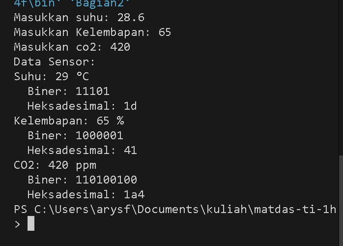

# UTS MATEMATIKA DASAR
Nama : Fata Haidar Aly
Absen : 09
Kelas : TI 1H
NIM : 244107020108

# Bagian 1
# No1
Disini saya membuat program java untuk setiap poin konversi bilangan dari desimal, biner, dan heksadesimal
# Poin 1
Disini saya membuat program pada file Bagian1No1Poin1.java. File ini berisikan program konversi 2 inputan bilangan desimal untuk di konversi menjadi biner dan heksa deimal.
```sh
StringBuilder angkaBiner = new StringBuilder();
if (angka == 0) {
    angkaBiner.append("0");
} else {
    while (angka > 0) {
        int sisa = angka % 2;
        angkaBiner.insert(0, sisa); 
        angka = angka / 2;
    }
}
System.out.println("Hasil dari desimal ke biner = " + angkaBiner);
```
Program diatas digunakan untuk mengkonversi bilngan desimal ke biner. dengan tujuan 
- membuat objek StringBuilder bernama angkaBiner untuk menyimpan hasil konversi biner.
- Jika angka adalah 0, akan langsung menambahkan "0" ke angkaBiner.
- Jika tidak, akan menggunakan loop while untuk membagi angka dengan 2 dan menyimpan sisa pembagian (0 atau 1) di depan angkaBiner. Proses ini terus berlanjut hingga angka menjadi 0.
-Setelah selesai, akan mencetak hasil konversi dari desimal ke biner.

Adapun program mengkonversi bilangan desimal ke heksadesimal sebagai berikut.
```sh
String heksadesimal = "";
char heksadesimal_char[] = {'0', '1', '2', '3', '4', '5', '6', '7', '8', '9', 'A', 'B', 'C', 'D', 'E', 'F'};

if (angka_desimal == 0) {
    heksadesimal = "0";
} else {
    while (angka_desimal > 0) {
        int index = angka_desimal % 16;
        heksadesimal = heksadesimal_char[index] + heksadesimal; 
        angka_desimal = angka_desimal / 16;
    }
}
System.out.println("Hasil dari desimal ke heksadesimal = " + heksadesimal);
```
Program ini bertujuan untuk :
- mendeklarasikan sebuah string heksadesimal untuk menyimpan hasil konversi heksadesimal.
- Akan membuat array karakter heksadesimal_char yang berisi semua simbol heksadesimal dari 0 hingga F.
- Jika angka_desimal adalah 0, kita set heksadesimal menjadi "0".
- Jika tidak, aakan menggunakan loop while untuk membagi angka_desimal dengan 16 dan menyimpan hasilnya dalam heksadesimal dengan cara yang sama seperti konversi biner. Yaitu menggunakan sisa pembagian untuk mendapatkan indeks dari karakter heksadesimal yang sesuai.
- Setelah selesai, akan mencetak hasil konversi dari desimal ke heksadesimal.

Berikut Tampilan hasil pemograman


# Poin 2
Disini saya membuat program pada file Bagian1No1Poin2.java. File ini berisikan program konversi 1 inputan bilangan biner untuk di konversi menjadi desimal dan heksa deimal. 
```sh
int angkadesimal = 0;
int j = 1;
for (int i = bil_biner.length() - 1; i >= 0; i--) {
    int digit = Character.getNumericValue(bil_biner.charAt(i));
    angkadesimal += (digit * j);
    j *= 2;
}
System.out.println("Hasil dari biner ke desimal = " + angkadesimal);
```
Program diatas merupakan program mengkonversi dari bilangan biner ke desimal. dengan tujuan,
- mendeklarasikan variabel angkadesimal untuk menyimpan hasil konversi ke desimal dan j untuk menghitung nilai posisi biner (dimulai dari 1).
- Menggunakan loop for, dengan iterasi dari akhir string biner ke awal. Di setiap iterasi, akan mendapatkan nilai digit biner menggunakan Character.getNumericValue().
- mengalikan digit dengan j (yang merupakan nilai posisi biner) dan menambahkannya ke angkadesimal.
- Setelah itu, akan mengalikan j dengan 2 untuk mempersiapkan nilai posisi biner berikutnya.
- Setelah loop selesai, akan mencetak hasil konversi dari biner ke desimal.

Selanjutnya program mengkonversi bilangan biner ke heksadesimal seperti berikut,
Diawali dengan mendeklarasikan variabel heksadesimal seperti kode dibawah.
```sh
String heksadesimal = "";
char heksadesimal_char[] = {'0', '1', '2', '3', '4', '5', '6', '7', '8', '9', 'A', 'B', 'C', 'D', 'E', 'F'};
int panjangBilanganBiner = bil_biner.length();
int desimal = 0;
int posisiDigitBiner = 0;
```
Program diatas merupakan program yang mendeklarasikan varia bel heksa desmial. dengan tujuan,
- Mendeklarasikan string heksadesimal untuk menyimpan hasil konversi heksadesimal.
- Membuat array karakter heksadesimal_char yang berisi semua simbol heksadesimal dari 0 hingga F.
- Menyimpan panjang dari bilangan biner dalam variabel panjangBilanganBiner, dan mendeklarasikan desimal untuk menghitung nilai desimal sementara serta posisiDigitBiner untuk melacak posisi digit biner saat kita mengonversi.

Berikutnya program menghitung konversi biner ke heksadesimal, sebagai berikut
```sh
for (int i = 0; i < panjangBilanganBiner; i++) {
    int biner = Character.getNumericValue(bil_biner.charAt(panjangBilanganBiner - i - 1));
    if (biner != 0) {
        desimal += biner * (int) Math.pow(2, posisiDigitBiner);
    }
    posisiDigitBiner++;
    if (posisiDigitBiner > 3 || (i == panjangBilanganBiner - 1 && (panjangBilanganBiner % 4) > 0)) {
        posisiDigitBiner = 0;
        heksadesimal = heksadesimal_char[desimal] + heksadesimal;
        desimal = 0;
    }
}
```
Program diatas bertujuan untuk menggunakan loop for untuk iterasi melalui setiap digit biner.
- mendapatkan nilai digit biner dari belakang menggunakan Character.getNumericValue().
- Jika digit biner tidak sama dengan 0, akan menambahkan nilai desimal sementara dengan mengalikan digit biner dengan 2 pangkat posisi digit biner.
- Kemudian meningkatkan posisiDigitBiner untuk melacak posisi digit.
- Jika posisiDigitBiner lebih dari 3 (setiap 4 digit biner membentuk 1 digit heksadesimal) atau jika berada di digit terakhir dan panjang biner tidak habis dibagi 4, akan mengonversi nilai desimal ke heksadesimal dan menambahkannya ke string heksadesimal. Setelah itu,akan melakukan reset desimal ke 0 untuk menghitung digit berikutnya.

Berikut Tampilan hasil pemograman


# Poin 3
Disini saya membuat program pada file Bagian1No1Poin3.java. File ini berisikan program konversi 1 inputan bilangan heksadesimal untuk di konversi menjadi desimal dan biner deimal. 
```sh
for (int i = 0; i < panjang_heksadesimal; i++) {
    char key = heksadesimal.charAt(i);
    int nilaiHex;

    if (key >= '0' && key <= '9') {
        nilaiHex = key - '0'; 
    } else if (key >= 'A' && key <= 'F') {
        nilaiHex = key - 'A' + 10; 
    } else {
        System.out.println("Karakter heksadesimal tidak valid: " + key);
        return; 
    }

    desimal += nilaiHex * Math.pow(16, panjang_heksadesimal - 1 - i);
}
System.out.println("Hasil dari heksadesimal ke desimal = " + desimal);
}
System.out.println("Hasil dari biner ke desimal = " + angkadesimal);
```
Program diatas merupakan program mengkonversi dari bilangan heksadesimal ke desimal. dengan tujuan,
-  menggunakan loop for untuk iterasi melalui setiap karakter dalam string heksadesimal.
- Di setiap iterasi, akan mendapatkan karakter heksadesimal menggunakan charAt(i).
- deklarasikan variabel nilaiHex untuk menyimpan nilai desimal dari karakter heksadesimal.
- Jika karakter adalah angka (0-9), akan mengonversinya menjadi nilai desimal dengan mengurangkan '0'.
- Jika karakter adalah huruf (A-F), akan mengonversinya menjadi nilai desimal dengan mengurangkan 'A' dan menambahkan 10.
- Jika karakter tidak valid, akan mencetak pesan kesalahan dan menghentikan program dengan return.
- kemudian menambahkan nilai desimal yang dihitung ke variabel desimal, dengan mengalikan nilaiHex dengan 16 pangkat posisi karakter (dihitung dari kanan ke kiri).
- Setelah loop selesai, akan mencetak hasil konversi dari heksadesimal ke desimal.

Selanjutnya program mengkonversi bilangan heksadesimal ke biner seperti berikut,

```sh
for (int i = 0; i < panjang_heksadesimal; i++) {
    char index = heksadesimal.charAt(i);
    String binaryValue = "";

    if (index >= '0' && index <= '9') {
        binaryValue = String.format("%4s", Integer.toBinaryString(index - '0')).replace(' ', '0');
    } else if (index >= 'A' && index <= 'F') {
        binaryValue = String.format("%4s", Integer.toBinaryString(index - 'A' + 10)).replace(' ', '0');
    } else {
        System.out.println("Karakter heksadesimal tidak valid: " + index);
        return; 
    }

    biner += binaryValue; 
}
```
Program diatas merupakan program mengkonversi dari bilangan heksadesimal ke biner. dengan tujuan,
-  Menggunakan loop for lagi untuk iterasi melalui setiap karakter dalam string heksadesimal untuk mengonversinya ke biner.
- Di setiap iterasi, kita mendapatkan karakter heksadesimal menggunakan charAt(i).
- mendeklarasikan string binaryValue untuk menyimpan hasil konversi biner dari karakter heksadesimal.
- Jika karakter adalah angka (0-9), kita mengonversinya menjadi biner menggunakan Integer.toBinaryString() dan memformatnya menjadi 4 digit dengan String.format(). Jika hasilnya kurang dari 4 digit, kita mengganti spasi dengan '0' untuk memastikan panjangnya 4.
- Jika karakter adalah huruf (A-F), kita melakukan hal yang sama dengan mengonversinya menjadi biner.
- Jika karakter tidak valid, akan mencetak pesan kesalahan dan menghentikan program dengan return.
- kemudian kemudian menambahkan hasil biner ke string biner.

Adapun sebuah program yang digunakan untuk menhapus angka 0 biner yang terdapat di depan,
```s
biner = biner.replaceFirst("^0+(?!$)", "");
```
program tersebut berfungsi untuk menghapus semua nol di depan string biner menggunakan replaceFirst(). Ini memastikan bahwa hasil biner tidak memiliki nol yang tidak perlu di depan, kecuali jika hasilnya adalah 0.

Berikut Tampilan hasil pemograman


# No2
Disini saya membuat program java untuk setiap poin melakukan operasi pada bilangan biner dari pertambahan biner, pengurangan biner, perkalian biner, dan operasi AND,OR, dan XOR pada bilangan biner.
# Poin 1
Disini saya membuat program pada file Bagian1No2Poin1.java. File ini berisikan program operasi pertambahan biner.
```
int n1=Integer.parseInt(x, 2);
        int n2=Integer.parseInt(y, 2);
        int n3=n1+n2;
```
program diatas bertujuan unutk mengkonfersi biner ke desimal, ini mengonversi string x (angka biner pertama) menjadi bilangan bulat desimal menggunakan basis 2 dan menyimpannya dalam variabel n1, selanjutnya, Baris ini mengonversi string y (angka biner kedua) menjadi bilangan bulat desimal menggunakan basis 2 dan menyimpannya dalam variabel n2, dan Baris ini menjumlahkan n1 dan n2, hasilnya disimpan dalam variabel n3.

Berikut Tampilan hasil pemograman


# Poin 2
Disini saya membuat program pada file Bagian1No2Poin2.java. File ini berisikan program operasi pengurangan biner.
```
int n1=Integer.parseInt(x, 2);
        int n2=Integer.parseInt(y, 2);
        int n3=n1-n2;
```
program diatas bertujuan unutk mengkonfersi biner ke desimal, ini mengonversi string x (angka biner pertama) menjadi bilangan bulat desimal menggunakan basis 2 dan menyimpannya dalam variabel n1, selanjutnya, Baris ini mengonversi string y (angka biner kedua) menjadi bilangan bulat desimal menggunakan basis 2 dan menyimpannya dalam variabel n2, dan Baris ini mengurangkan n1 dan n2, hasilnya disimpan dalam variabel n3.

Berikut Tampilan hasil pemograman


# Poin 3
Disini saya membuat program pada file Bagian1No2Poin3.java. File ini berisikan program operasi pengkalian biner.
```
int n1=Integer.parseInt(x, 2);
        int n2=Integer.parseInt(y, 2);
        int n3=n1*n2;
```
program diatas bertujuan unutk mengkonfersi biner ke desimal, ini mengonversi string x (angka biner pertama) menjadi bilangan bulat desimal menggunakan basis 2 dan menyimpannya dalam variabel n1, selanjutnya, Baris ini mengonversi string y (angka biner kedua) menjadi bilangan bulat desimal menggunakan basis 2 dan menyimpannya dalam variabel n2, dan Baris ini mengksliksn n1 dan n2, hasilnya disimpan dalam variabel n3.

Berikut Tampilan hasil pemograman


# Poin 4
Disini saya membuat program pada file Bagian1No2Poin4.java. File ini berisikan program operasi AND, OR, dan XOR pada bilangan biner.
Diawali dengan mengkonversikan biner dengan desimal
```
int n1=Integer.parseInt(x, 2);
        int n2=Integer.parseInt(y, 2);
```
program diatas bertujuan unutk mengkonfersi biner ke desimal, ini mengonversi string x (angka biner pertama) menjadi bilangan bulat desimal menggunakan basis 2 dan menyimpannya dalam variabel n1, sama seperti baris pertama, Baris ini mengonversi string y (angka biner kedua) menjadi bilangan bulat desimal menggunakan basis 2 dan menyimpannya dalam variabel n2.

Setelah dikonversi melakukan operasi AND pada bilangan biner yang sudah diubah ke desimal.
```
 int andResult = n1 & n2;
```
Program ini melakukan operasi AND antara n1 dan n2. Operasi AND akan menghasilkan angka baru yang hanya memiliki 1 di posisi yang sama jika kedua angka biner juga memiliki 1 di posisi tersebut. Hasilnya disimpan dalam variabel andResult

setelah itu melakukan operasi OR pada bilangan biner yang sudah dubah ke desimal.
```
 int orResult = n1 | n2;
```
Program ini melakukan operasi OR antara n1 dan n2. Operasi OR akan menghasilkan angka baru yang memiliki 1 di posisi mana pun jika salah satu dari kedua angka biner memiliki 1 di posisi tersebut. Hasilnya disimpan dalam variabel orResult.

setelah itu melakukan operasi XOR pada bilangan biner yang sudah dubah ke desimal.
```
 int xorResult = n1 ^ n2;
```
Program ini melakukan operasi XOR antara n1 dan n2. Operasi XOR akan menghasilkan angka baru yang memiliki 1 di posisi yang sama jika hanya satu dari kedua angka biner yang memiliki 1 di posisi tersebut. Hasilnya disimpan dalam variabel xorResult.

Selanjutnya mengkonversikan bilangan desimal ke biner kembali dengan kode program dibawah ini.
```
 String andBinary = Integer.toBinaryString(andResult);
        String orBinary = Integer.toBinaryString(orResult);
        String xorBinary = Integer.toBinaryString(xorResult);
```
Program diatas bertujuan untuk :
- mengonversi hasil dari operasi AND (andResult) kembali ke format biner dan menyimpannya dalam variabel andBinary.
- mengonversi hasil dari operasi OR (orResult) kembali ke format biner dan menyimpannya dalam variabel orBinary.
-  mengonversi hasil dari operasi XOR (xorResult) kembali ke format biner dan menyimpannya dalam variabel xorBinary.

Berikut Tampilan hasil pemograman


# Bagian 2
# No1
Disini saya membuat program pada file Bagian2.java. File ini berisikan program Simulasi pengolahan data dari sensor dengan format desimal, biner, dan heksadesimal.

Pertama melakukan inisialisasi pembulatan nilai suhu
```
 int suhuBulat = roundSuhu(suhu);
```
Program ini memanggil fungsi roundSuhu untuk membulatkan nilai suhu yang dimasukkan. Hasil pembulatan disimpan dalam variabel suhuBulat.

Selanjutnya melakukan konversi nilai desimal suhu ke biner dan heksadesimal
```
String suhuBiner = Integer.toBinaryString(suhuBulat);
String suhuHex = Integer.toHexString(suhuBulat);
```
Program ini  mengonversi suhu bulat (suhuBulat) ke dalam format biner dan heksadesimal. Hasil konversi disimpan dalam variabel suhuBiner dan suhuHex.

Selanjutnya melakukan konversi nilai desimal kelembapan ke biner dan heksadesimal
```
String kelembapanBiner = Integer.toBinaryString(kelembapan);
String kelembapanHex = Integer.toHexString(kelembapan);
```
Program ini  mengonversi nilai kelembapan ke dalam format biner dan heksadesimal, menyimpannya dalam variabel kelembapanBiner dan kelembapanHex.

Selanjutnya melakukan konversi nilai desimal co2 ke biner dan heksadesimal
```
String kelembapanBiner = String co2Biner = Integer.toBinaryString(co2);
String co2Hex = Integer.toHexString(co2);
```
Program ini  mengonversi kadar CO2 ke dalam format biner dan heksadesimal, menyimpannya dalam variabel co2Biner dan co2Hex.

Selanjutnya membuat fungsi pembulatan suhu.
```
public static int roundSuhu(double value) {
    int roundedValue;
    double decimalPart = value - Math.floor(value); 

    if (decimalPart >= 0.5 && decimalPart < 1) {
        roundedValue = (int) Math.ceil(value); 
    } else {
        roundedValue = (int) Math.floor(value); 
    }
    return roundedValue;
}
```
Fungsi ini bertanggung jawab untuk membulatkan suhu. Ia memeriksa bagian desimal dari suhu dan membulatkannya ke atas jika bagian desimal 0.5 atau lebih, dan ke bawah jika kurang dari 0.5. Fungsi ini memastikan bahwa suhu yang ditampilkan adalah angka bulat yang tepat.

Berikut Tampilan hasil pemograman



# Bagian 3
# No1
Disini saya membuat program pada file Bagian3.java. File ini berisikan program yang melakukan operasi enkripsi sederhana.

Melakukan ennkipsi bilangan pertama
```
String encrypted1 = xorBinary(binary1, key);
```
Program ini memanggil fungsi xorBinary untuk mengenkripsi binary1 menggunakan key. Hasil enkripsi disimpan dalam variabel encrypted1.

Selanjutnya Melakukan ennkipsi bilangan kedua
```
String encrypted2 = xorBinary(binary2, key);
```
Program ini melakukan hal yang sama untuk binary2, mengenkripsinya dengan key dan menyimpan hasilnya dalam encrypted2.

Selanjutnya melakukan konversi hasil enkripsi ke Heksadesimal

```
String encrypted1Hex = Integer.toHexString(Integer.parseInt(encrypted1, 2));
String encrypted2Hex = Integer.toHexString(Integer.parseInt(encrypted2, 2));
```
Program ini mengonversi hasil enkripsi encrypted1 dan encrypted2 dari biner ke heksadesimal. Ini dilakukan dengan mengonversi string biner menjadi integer menggunakan Integer.parseInt dan kemudian mengonversi integer tersebut ke string heksadesimal menggunakan Integer.toHexString.

Yang terakhir membuat fungsi XOR untuk enkripsi
```
public static String xorBinary(String binary, String key) {
    StringBuilder result = new StringBuilder();
    for (int i = 0; i < binary.length(); i++) {
        char bit = (binary.charAt(i) == key.charAt(i)) ? '0' : '1';
        result.append(bit);
    }
    return result.toString();
}
```
Fungsi ini melakukan operasi XOR antara setiap bit dari bilangan biner dan kunci. Jika bit dari bilangan biner dan kunci sama, hasilnya adalah '0'; jika berbeda, hasilnya adalah '1'. Hasilnya disimpan dalam StringBuilder dan dikembalikan sebagai string.

Berikut Tampilan hasil pemograman


