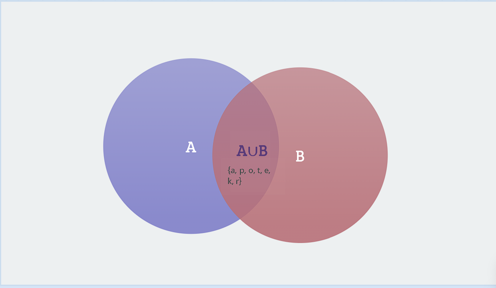

# Jawaban Quiz Matematika Dasar 1

# NO 1

#### Penjelasan 

Argumen yang diberikan dapat disusun dalam bentuk logika proposisional sebagai berikut:

1.  **p → ~q**: Jika saya pulang kampung (p), maka saya tidak bisa mengikuti ujian susulan (~q).
2.  **~r → p**: Jika saya tidak lulus ujian (~r), maka saya pulang kampung (p).
3.  **q**: Saya bisa mengikuti ujian susulan (q).

Dari pernyataan-pernyataan di atas, dapat disimpulkan bahwa saya lulus ujian **r**.

#### Langkah Penyelesaian

**1.**   Dari premis 3, **q**  benar. Ini bertentangan dengan  **~q**  dari premis 1. Oleh karena itu,  **p**  harus salah agar  **~q**  tidak terjadi. Jadi, dapat disimpulkan bahwa  **~p**  (saya tidak pulang kampung).

**2.**  Dengan  **~p**  (saya tidak pulang kampung), ,aka lanjutkan mengerjakan premis 2. Karena premis 2 adalah  **~r → p**  (jika saya tidak lulus ujian, maka saya pulang kampung), dan  **p**  adalah salah, maka  **~r**  juga harus salah untuk membuat implikasi ini benar. Oleh karena itu,  **r**  harus benar.

**3.**  Oleh karena itu, kesimpulan yang didapat adalah  **r**  (saya lulus ujian).

## No 2
#### Tabel Kebenaran untuk Tautologi

### a. ~p → (p → q)
| p | q | ~p | p → q | ~p →(p → q) | 
|----------|----------|----------|----------| ----------|
| T  | T   | F   | T | T |
| T  | F   | F   | F | T |
| F  | T   | T   | T | T |
| F  | F   | T   | F | F |

### b.  ~(p → q) → ~q
| p | q | p → q | ~(p → q) | ~ q| ~(p → q) → ~q |
|----------|----------|----------|----------| ----------| ----------|
| T  | T   | T   | F | F | T |
| T  | F   | F  | T | T | T |
| F  | T   | T   | F | F | T |
| F  | F   | F   | T | T | T |

### c. (p ∧ q) → (p → q)

| p | q |p∧q | p → q | (p ∧ q) → (p → q)| 
|----------|----------|----------|----------| ----------|
| T  | T   | T  | T | T |
| T  | F   | F   | F | T |
| F  | T   | F  | T | T |
| F  | F   | F  | T | T|

### Kesimpulan

-   **a**  ~p → (p → q):  **Bukan tautologi**
-   **b**  ~(p → q) → ~q:  **Tautologi**
-   **c**  (p ∧ q) → (p → q):  **Tautologi**

## No 3

1.  **Himpunan mahasiswa dengan nilai A**:
    
    -   Seorang mahasiswa mendapat nilai A jika nilai UTS dan nilai UAS keduanya di atas 80. Dalam notasi himpunan, ini dapat dinyatakan sebagai:
    
  
    A=P∩Q  
   Ini berarti himpunan A adalah irisan antara himpunan P dan himpunan Q.
   
2.  **Himpunan mahasiswa dengan nilai B**:
    
   -   Seorang mahasiswa mendapat nilai B jika salah satu ujian di atas 80. Dalam notasi himpunan, ini dapat dinyatakan sebagai:
    
    
       B=P∪Q 
   Ini berarti himpunan B adalah gabungan antara himpunan P dan himpunan Q.
   
3.  **Himpunan mahasiswa dengan nilai C**:
    
   -   Seorang mahasiswa mendapat nilai C jika kedua ujian di bawah 80. Dalam notasi himpunan, ini dapat dinyatakan sebagai:
   
       
       
        C=U−(P∪Q) 
Ini berarti himpunan C adalah himpunan mahasiswa U dikurangi gabungan dari himpunan P dan himpunan Q.

####   Kesimpulan

-   **Himpunan A**:  A= P∩Q
-   **Himpunan B**:  B=P∪Q
-   **Himpunan C**:  C=U−(P∪Q)
p
## No 4

Diketahui:

-   A={a,p,o,t,e,k} (huruf pembentuk kata "apotek")
-   B={r,a,p,o,t}

### Langkah-langkah:

1.  **Elemen dari A**: {a, p, o, t, e, k}
2.  **Elemen dari B**: {r, a, p, o, t}

Gabungan  A∪B  adalah : 

A∪B = {a,p,o,t,e,k,r}

## No 5
Diket :
-   A = {1,2,5,6,7,11,12,13,15,18,20}
-   C = {1,2,3,6,8,9,10,13,17,18}

### Langkah-langkah:

1.  **Identifikasi elemen yang ada di A**:
    -   A  memiliki elemen: 1, 2, 5, 6, 7, 11, 12, 13, 15, 18, 20
2.  **Identifikasi elemen yang ada di C**:
    -   C  memiliki elemen: 1, 2, 3, 6, 8, 9, 10, 13, 17, 18
3.  **Cari elemen yang sama**:
    -   Elemen yang terdapat di  A  dan  C  adalah: 1, 2, 6, 13, 18

### Himpunan Irisan

Oleh karena itu, irisan  A∩C  adalah:
A∩C = {1,2,6,13,18}

